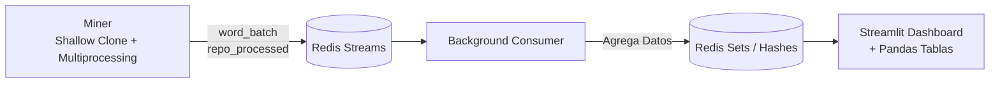

# GitHub Method Word Ranker

Herramienta que mina repositorios Python y Java hiper-populares desde GitHub de forma local y altamente paralelizada. Extrae metodologías y patrones semánticos mediante el nombrado de funciones, procesándolos para un ranking en tiempo casi real.

## Arquitectura



- **Miner**: recorre los repos más populares de GitHub por estrellas. Los descarga usando clones *shallow* (`git --depth 1`) superando las limitaciones REST, parsea paralelamente el código (`ast` y `javalang`), fragmenta variables en componentes funcionales (`lower_snake_case`) y publica los conteos al intermediario.
- **Consumer**: worker independiente (Consumer Group) que consume continuamente el Stream inyectando métricas complejas en Redis.
- **Dashboard**: web UI enriquecida implementada con la reactividad de `Streamlit`, visualizando analíticas globales y detalles iterando repositorios vía dataframes en Pandas.

## Requisitos

- [Docker](https://docs.docker.com/get-docker/) y Docker Compose
- (Opcional) Un [token de acceso personal de GitHub](https://github.com/settings/tokens) (Ayudará en la búsqueda de los repositorios a investigar)

## Ejecución

1. Clonar este proyecto a tu equipo:
   ```bash
   cd github-method-word-ranker
   ```

2. (Opcional) Configurar ambiente (Especialmente tokens de API):
   ```bash
   cp .env.example .env
   # Editar .env y agregar tu GITHUB_TOKEN
   ```

3. Construir y levantar todo el Pipeline Computacional:
   ```bash
   docker compose up --build
   ```

4. Abrir tu navegador en el centro de control generado:
   ```
   http://localhost:8501
   ```

5. Detención de contenedores interactiva:
   ```bash
   docker compose down
   ```

## Estructura de Directorios

```
github-method-word-ranker/
├── docker-compose.yml          # Topología Dockerizada interconectada
├── .env.example                # Variables de entorno
├── docs/
│   ├── architecture.md         # Documentación en Mermaid de Topología
│   └── event-contract.md       # Esquemas de payloads y claves en la REDIS DB
├── miner/
│   ├── Dockerfile
│   ├── requirements.txt
│   ├── src/miner/
│   │   ├── main.py             # Pool Workers + Orchestrator
│   │   ├── config.py           # Ingestor configs `MAX_WORKERS` / `CLONE_DIR`
│   │   ├── github_client.py    # Github REST Client limit-aware
│   │   ├── repo_cloner.py      # Gestor local Shallow git clone y file discovery
│   │   ├── parsers/
│   │   │   ├── python_parser.py  # Python `ast` syntax parser
│   │   │   └── java_parser.py    # `javalang` JVM parser
│   │   ├── splitter.py         # Acrónimos, CamelCase normalizer
│   │   ├── range_scheduler.py  # Fragmentador paginación recursiva estrellas
│   │   └── publisher.py        # Stream dispatcher
│   └── tests/                  # 48 tests unitarios (pytest) aislando flujos
└── visualizer/
    ├── Dockerfile
    ├── entrypoint.sh           # Foreground (Streamlit) + Background (Consumer)
    ├── requirements.txt
    ├── src/visualizer/
    │   ├── app.py              # Front (Streamlit) Panel Configs y Pandas Df.
    │   ├── charts.py           # Plotly Interactive graphs builder
    │   ├── consumer.py         # Extractor Reactivo persistente
    │   ├── redis_store.py      # Abstracciones para lecturas optimizadas zsets/hashes
    │   └── settings.py
    └── tests/                  # 5 tests unitarios mockeados.
```

## Decisiones Críticas en el Diseño Computacional

| Elección | Explicación Técnica |
| --- | --- |
| **Clonado Shallow v/s API REST** | Las llamadas unitarias por la API asfixiaban el límite de Github en segundos. Utilizar el binario `git clone --depth 1` nos concede descargar millones de líneas de código bajo una única transacción de red global por repo y 0 consumo en el Token API. |
| **Multiprocessing en vez de Threading** | En Python, el `GIL` bloquea a los threads del verdadero procesamiento CPU en Paralelo. El parseo de los lenguajes es un problema *CPU-bound*, por ende instanciar Pools de subprocesos aislados acelera exponencialmente las métricas procesando simultáneo en cada core de la máquina huésped. |
| **Pandas en el Dashboard** | Simplifica inmensamente el pre-procesamiento, sanitización de campos y rendereo robusto ordenable de la **Tabla de Repositorios Analizados**, listando estatus en tiempo vivo sin depender del render normal. |
| **Redis Streams + Sorted Sets** | Aislar la ingesta intensiva con Streams permite escalar a decenas de Miners. Mientras tanto, las lecturas pesadas (UI) consultan Sorted Sets `O(log(N))` sin frenar las transacciones activas. |

## Ajustes del Entorno (`.env`)

| Variable | Inicial | Propósito |
| --- | --- | --- |
| `MAX_WORKERS` | `4` | Cantidad de sub-procesos Python para el Multiprocessing del Miner. |
| `CLONE_DIR` | `/tmp/miner_clones` | Localización en disco efímero de los clones shallow. |
| `TOP_N_DEFAULT` | `10` | Ajuste inicial del ranking de barras de UI |
| `UI_REFRESH_SECONDS`| `3` | Intervalo temporal de regeneración gráfica y tabular en FrontEnd. |

## Desarrollo y Tests

El sistema cubre rigurosamente sus responsabilidades con 53 validaciones que protegen regresiones futuras.

```bash
# Entorno Miner Pruebas (Instalando pytest, requests, redis, javalang)
cd miner
PYTHONPATH=src pytest tests/ -v

# Entorno Visualizer Pruebas (Instalando pytest, streamlit, plotly, pandas)
cd visualizer
PYTHONPATH=src pytest tests/ -v
```
