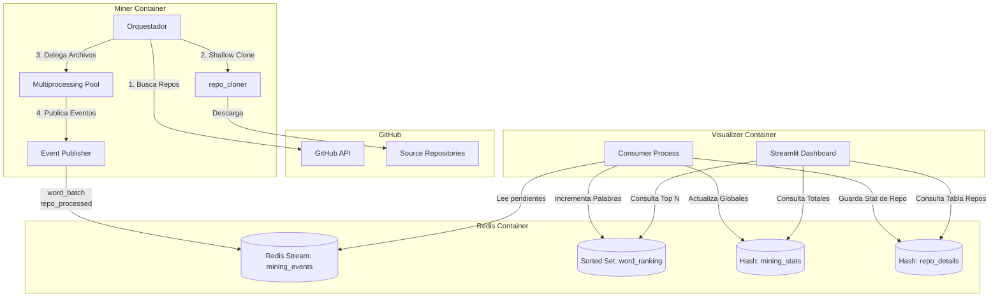

# Arquitectura

El sistema ha evolucionado de un simple recolector HTTP archivo-por-archivo hacia un pipeline de procesamiento paralelo basado en clonado local, todo interconectado mediante un broker de eventos asíncrono.

## Diagrama de Arquitectura

## Flujo de datos actualizado

1. **Búsqueda**: El miner obtiene repositorios desde la API REST de GitHub, procesando desde los más populares (estrellas) en rangos divididos de forma recursiva.
2. **Clonado**: En lugar de saturar la limitadísima API de Github con miles de peticiones de contenido (`get_file_content`), se ejecuta un comando liviano `git clone --depth 1` que transfiere una copia estática local utilizando el propio binario de Git.
3. **Parseo Concurrente**: Superado el límite de red, el parseo de archivos (Python `ast`, Java `javalang`) es una operación limitada únicamente por CPU. Usando `multiprocessing.Pool`, múltiples "workers" levantan intérpretes aislados, evadiendo el Global Interpreter Lock (GIL) de Python, y parsean múltiples archivos simultáneamente.
4. **Broker y Contrato (Eventos)**: Constantemente publican la información extraída a un modelo Productor-Consumidor.
5. **Reducción y Visualización**: En un container independiente, el proceso oculto `consumer.py` ingesta este log persistente para generar agregados en Redis (Sets, Hashes, Diccionarios serializados). La aplicación de `Streamlit` simplemente consulta Redis de manera read-only en su propio ciclo de renderizado, exponiendo gráficas interactivas y tablas densas basadas en `Pandas`.

## Notas de diseño

- **Ahorro Radical de Quotas de Red**: `git clone` y la red perimetral de distribución de repositorios de Github no consumen tokens de la API REST para su descarga de código base.
- **Topologías sin Cuello de Botella**: La separación entre el Productor (Miner) del Consumidor (Visualizador Agregador), mediado por Redis Streams, soporta una alta variabilidad (ej: repositorios de Linux que explotan el Productor, sin derribar o congelar las gráficas del Consumidor).
- **Manejo de Estado Pasivo UX**: Toda lógica pesada o costosa queda relegada a procesos paralelos sin bloquear jamás los charts finales para el usuario.
