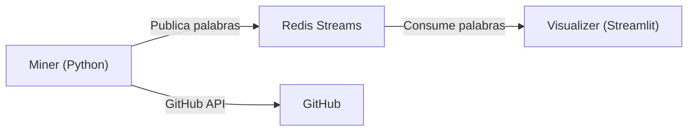

# Plan de Implementación — Prueba de Diagnóstico

Herramienta para identificar las palabras más utilizadas en nombres de métodos/funciones de Python y Java, a partir de repositorios de GitHub.

## Stack Tecnológico Propuesto

| Componente | Tecnología | Justificación |
| --- | --- | --- |
| **Miner** | Python 3.12 | Excelentes librerías para API de GitHub y parsing de código |
| **Visualizer** | Python 3.12 + Streamlit | Dashboard interactivo en tiempo real con mínimo código |
| **Message Broker** | Redis Streams | Modelo productor–consumidor ligero, persistente y en tiempo real |
| **Java Parser** | `javalang` | Parser liviano y más robusto que regex para extraer métodos Java reales |
| **Contenedores** | Docker + Docker Compose | Orquestación simple, ejecución con un solo comando |

---

## Arquitectura General



> [!IMPORTANT]
> **Modelo Productor–Consumidor**: El Miner publica palabras extraídas en un stream de Redis. El Visualizer consume del stream y actualiza la visualización en tiempo real. Ambos componentes son independientes y se comunican únicamente a través de Redis.
>
> Para evitar perder estado al reiniciar el visualizer, el ranking y las métricas agregadas también se materializan en Redis a medida que llegan nuevos eventos.

---

## Estructura del Repositorio

```
prueba-diagnostico/
├── implementation_plan.md
├── requisitos-proyecto.md
└── github-method-word-ranker/
    ├── AGENTS.md
    ├── README.md
    ├── .env.example
    ├── .gitignore
    ├── docker-compose.yml
    ├── docs/
    │   ├── architecture.md
    │   └── event-contract.md
    ├── miner/
    │   ├── Dockerfile
    │   ├── requirements.txt
    │   ├── requirements-dev.txt
    │   ├── src/miner/
    │   │   ├── __init__.py
    │   │   ├── config.py
    │   │   ├── main.py
    │   │   ├── github_client.py
    │   │   ├── publisher.py
    │   │   ├── range_scheduler.py
    │   │   ├── splitter.py
    │   │   └── parsers/
    │   │       ├── __init__.py
    │   │       ├── java_parser.py
    │   │       └── python_parser.py
    │   └── tests/
    │       ├── test_java_parser.py
    │       ├── test_python_parser.py
    │       ├── test_range_scheduler.py
    │       └── test_splitter.py
    └── visualizer/
        ├── Dockerfile
        ├── entrypoint.sh
        ├── requirements.txt
        ├── requirements-dev.txt
        ├── src/visualizer/
        │   ├── __init__.py
        │   ├── app.py
        │   ├── charts.py
        │   ├── consumer.py
        │   ├── redis_store.py
        │   └── settings.py
        └── tests/
            └── test_consumer.py
```

---

## Proposed Changes

### Miner

Componente encargado de recolectar y procesar datos desde GitHub.

#### [NEW] [main.py](github-method-word-ranker/miner/src/miner/main.py)

Entry point del miner. Orquesta el flujo principal:

1. **Buscar repositorios** ordenados por stars (descendente) vía GitHub Search API
2. **Para cada repositorio**, obtener el árbol de archivos y filtrar `.py` y `.java`
3. **Descargar el contenido** de cada archivo relevante (via GitHub API raw content)
4. **Parsear** el código fuente para extraer nombres de funciones/métodos
5. **Dividir** los nombres en palabras individuales
6. **Publicar** cada palabra en Redis Stream y registrar el avance del repositorio procesado

**Flujo continuo**: el miner itera por páginas de repositorios de forma indefinida (con paginación), respetando rate limits de GitHub API. Se detiene solo al recibir señal de interrupción (SIGINT/SIGTERM).

Para evitar el límite práctico de resultados de GitHub Search y mantener el orden global por popularidad, la iteración se particiona por rangos de stars. El miner persiste el cursor actual (rango/página) y el último repositorio procesado para poder continuar sin reprocesar inmediatamente los mismos repositorios.

**Variables de entorno**:
- `GITHUB_TOKEN`: token de acceso personal (opcional pero recomendado para evitar rate limits)
- `REDIS_HOST`: host de Redis (default: `redis`)
- `REDIS_PORT`: puerto de Redis (default: `6379`)
- `STREAM_NAME`: nombre del Redis Stream (default: `mining_events`)

#### [NEW] [github_client.py](github-method-word-ranker/miner/src/miner/github_client.py)

Cliente para interactuar con la API de GitHub:

- `search_repos(page, per_page, stars_range=None)` → busca repos ordenados por stars descendente usando `/search/repositories` y permite acotar por rangos de stars cuando sea necesario
- `get_tree(owner, repo)` → obtiene el árbol recursivo del repo vía `/repos/{owner}/{repo}/git/trees/{sha}?recursive=1`
- `get_file_content(owner, repo, path)` → descarga el contenido raw del archivo
- Manejo de rate limiting con retry + backoff exponencial
- Soporte para `GITHUB_TOKEN` vía headers `Authorization: Bearer`

#### [NEW] [range_scheduler.py](github-method-word-ranker/miner/src/miner/range_scheduler.py)

Componente encargado de orquestar la iteración continua por rangos de stars:

- Define el rango de stars actual a consultar
- Subdivide rangos cuando la búsqueda es demasiado amplia
- Persiste cursor de rango/página para reanudar el procesamiento
- Evita reprocesamiento inmediato de repositorios ya recorridos

#### [NEW] [publisher.py](github-method-word-ranker/miner/src/miner/publisher.py)

Componente responsable de publicar eventos del miner en Redis:

- Publica lotes de palabras procesadas al stream `mining_events`
- Registra información suficiente para reconstruir métricas agregadas
- Expone un formato consistente para `word_batch` y `repo_processed`

#### [NEW] [python_parser.py](github-method-word-ranker/miner/src/miner/parsers/python_parser.py)

Extracción de nombres de funciones Python:

- Usa `ast` (módulo estándar) para parsear archivos `.py`
- Extrae nodos `ast.FunctionDef` y `ast.AsyncFunctionDef`
- Obtiene el nombre de cada función desde el atributo `.name`

#### [NEW] [java_parser.py](github-method-word-ranker/miner/src/miner/parsers/java_parser.py)

Extracción de nombres de métodos Java:

- Usa `javalang` para parsear archivos `.java`
- Extrae declaraciones de métodos reales (`MethodDeclaration`)
- Evita falsos positivos comunes de aproximaciones basadas en regex

> [!NOTE]
> Se usa `ast` para Python porque es robusto y no requiere dependencias externas. Para Java, se usa `javalang` como punto medio entre robustez y simplicidad: evita varias limitaciones de regex sin introducir la complejidad de un parser más pesado como ANTLR.

#### [NEW] [splitter.py](github-method-word-ranker/miner/src/miner/splitter.py)

Separación de nombres compuestos en palabras individuales:

- **snake_case**: split por `_` (ej: `make_response` → `["make", "response"]`)
- **camelCase / PascalCase**: split en transiciones de minúscula a mayúscula (ej: `retainAll` → `["retain", "all"]`)
- **SCREAMING_SNAKE_CASE**: split por `_` y lowercase
- Combina ambas estrategias para cubrir convenciones mixtas
- Filtra palabras vacías y convierte todo a minúsculas
- Filtra "dunder methods" de Python (ej: `__init__`, `__str__`) ya que son palabras reservadas del lenguaje y no representan decisiones del programador

#### [NEW] [requirements.txt](github-method-word-ranker/miner/requirements.txt)

```
requests>=2.31
redis>=5.0
javalang>=0.13
```

#### [NEW] [requirements-dev.txt](github-method-word-ranker/miner/requirements-dev.txt)

```
pytest>=8.0
```

#### [NEW] [Dockerfile](github-method-word-ranker/miner/Dockerfile)

```dockerfile
FROM python:3.12-slim
WORKDIR /app
ENV PYTHONPATH=/app/src
COPY requirements.txt requirements-dev.txt ./
RUN pip install --no-cache-dir -r requirements.txt
COPY src ./src
COPY tests ./tests
CMD ["python", "-m", "miner.main"]
```

---

### Visualizer

Componente encargado de procesar y visualizar el ranking de palabras.

#### [NEW] [consumer.py](github-method-word-ranker/visualizer/src/visualizer/consumer.py)

Worker encargado de consumir eventos desde Redis Streams:

- Lee mensajes nuevos desde `mining_events`
- Actualiza el ranking agregado en Redis
- Mantiene métricas persistidas para que la UI no dependa del estado en memoria

#### [NEW] [redis_store.py](github-method-word-ranker/visualizer/src/visualizer/redis_store.py)

Capa de acceso a Redis para el visualizer:

- Actualiza el `Sorted Set` `word_ranking`
- Actualiza el `Hash` `mining_stats`
- Expone operaciones de lectura para ranking y métricas

#### [NEW] [charts.py](github-method-word-ranker/visualizer/src/visualizer/charts.py)

Módulo responsable de la construcción de gráficos:

- Genera el gráfico de barras horizontal
- Centraliza la lógica de transformación de datos para la UI

#### [NEW] [settings.py](github-method-word-ranker/visualizer/src/visualizer/settings.py)

Módulo de configuración del visualizer:

- Centraliza variables de entorno y defaults del dashboard
- Define parámetros como `TOP_N_DEFAULT` y refresh interval

#### [NEW] [app.py](github-method-word-ranker/visualizer/src/visualizer/app.py)

Dashboard en Streamlit con:

- **Sidebar**: slider parametrizable para elegir top-N (5, 10, 25, 50, 100)
- **Gráfico de barras horizontal** (Plotly): muestra las N palabras más frecuentes
- **Word Cloud** (wordcloud lib): representación visual complementaria
- **Métricas en cards**: total de palabras procesadas, total de repos minados, palabra #1
- **Auto-refresh**: refresco periódico configurable (por ejemplo, cada 3 segundos) para reflejar nuevos datos sin intervención manual

**Lógica de consumo y visualización**:
- Usa un consumer group de Redis Streams para leer mensajes nuevos del stream `mining_events`
- Materializa el ranking agregado en Redis usando un `Sorted Set` (`word_ranking`)
- Mantiene métricas globales en un `Hash` (`mining_stats`), incluyendo al menos total de palabras, total de repos procesados y último repositorio procesado
- En cada refresh, la app consulta los agregados persistidos en Redis y re-renderiza, en vez de depender únicamente de un `Counter` en memoria

> [!NOTE]
> Esto permite que el visualizer recupere el estado del ranking después de un reinicio y hace explícito el contrato de datos compartidos entre ambos componentes.

#### [NEW] [requirements.txt](github-method-word-ranker/visualizer/requirements.txt)

```
streamlit>=1.30
redis>=5.0
plotly>=5.18
wordcloud>=1.9
matplotlib>=3.8
```

#### [NEW] [requirements-dev.txt](github-method-word-ranker/visualizer/requirements-dev.txt)

```
pytest>=8.0
```

#### [NEW] [entrypoint.sh](github-method-word-ranker/visualizer/entrypoint.sh)

Script de arranque del contenedor visualizer:

- Inicia el consumidor en segundo plano
- Levanta Streamlit expuesto en `0.0.0.0:8501`
- Deja explícita la separación entre consumo continuo y UI

#### [NEW] [Dockerfile](github-method-word-ranker/visualizer/Dockerfile)

```dockerfile
FROM python:3.12-slim
WORKDIR /app
ENV PYTHONPATH=/app/src
COPY requirements.txt requirements-dev.txt ./
RUN pip install --no-cache-dir -r requirements.txt
COPY entrypoint.sh ./entrypoint.sh
COPY src ./src
COPY tests ./tests
RUN chmod +x ./entrypoint.sh
EXPOSE 8501
CMD ["./entrypoint.sh"]
```

---

### Docker Compose

#### [NEW] [docker-compose.yml](github-method-word-ranker/docker-compose.yml)

```yaml
services:
  redis:
    image: redis:7-alpine
    ports:
      - "6379:6379"

  miner:
    build: ./miner
    depends_on:
      - redis
    environment:
      - REDIS_HOST=redis
      - GITHUB_TOKEN=${GITHUB_TOKEN:-}
      - STREAM_NAME=mining_events
    restart: unless-stopped

  visualizer:
    build: ./visualizer
    depends_on:
      - redis
    ports:
      - "8501:8501"
    environment:
      - REDIS_HOST=redis
      - STREAM_NAME=mining_events
```

**Ejecución con un solo comando**:
```bash
cd github-method-word-ranker && docker compose up --build
```

---

### Documentación

#### [NEW] [README.md](github-method-word-ranker/README.md)

Contendrá:
- Descripción del proyecto
- Diagrama de arquitectura
- Requisitos previos (Docker, token de GitHub)
- Instrucciones de ejecución
- Decisiones de diseño y supuestos
- Contrato básico de mensajes y claves Redis compartidas
- Estructura del repositorio

#### [NEW] [AGENTS.md](github-method-word-ranker/AGENTS.md)

Definirá:
- Restricciones de arquitectura del proyecto
- Reglas de trabajo para futuros agentes
- Prioridades de implementación
- Expectativas de verificación

#### [NEW] [architecture.md](github-method-word-ranker/docs/architecture.md)

Documentará:
- Arquitectura general del sistema
- Flujo de datos entre miner, Redis y visualizer
- Decisiones de separación entre consumo y UI

#### [NEW] [event-contract.md](github-method-word-ranker/docs/event-contract.md)

Documentará:
- Campos de `word_batch` y `repo_processed`
- Claves agregadas compartidas en Redis
- Variables de entorno comunes entre componentes

#### [NEW] [.env.example](github-method-word-ranker/.env.example)

Incluirá:
- Variables mínimas para GitHub, Redis y visualizer
- Defaults sugeridos para desarrollo local

---

## Decisiones de Diseño Clave

| Decisión | Justificación |
| --- | --- |
| **Redis Streams** en vez de Kafka/RabbitMQ | Más ligero, sin overhead de setup. Ideal para un sistema con un solo productor y un solo consumidor. Soporta persistencia y consumer groups. |
| **Streamlit** en vez de web app custom | Permite crear dashboards interactivos con muy poco código. Ideal para visualización de datos. |
| **`ast` para Python** | Parser oficial del lenguaje, manejo perfecto de todos los casos edge. No requiere dependencias. |
| **`javalang` para Java** | Más robusto que regex para extraer métodos y aún suficientemente liviano para este caso de uso. |
| **Agregados persistidos en Redis** | Evita perder el ranking y métricas al reiniciar el visualizer y hace explícito el contrato de datos compartido. |
| **GitHub API (REST)** en vez de clonar repos | Evita descargar repos completos. Más eficiente en ancho de banda. Permite filtrar solo archivos relevantes. |
| **Filtrar dunder methods** | `__init__`, `__str__`, etc. son convenciones del lenguaje, no decisiones del programador, y contaminarían el ranking. |

---

## Verification Plan

### Automated Tests

> [!NOTE]
> Para estas pruebas se considera `pytest` como dependencia de desarrollo del proyecto.

1. **Unit tests para `splitter.py`**:
   ```bash
   cd github-method-word-ranker/miner && python -m pytest tests/test_splitter.py -v
   ```
   Tests cubrirán: `snake_case`, `camelCase`, `PascalCase`, `SCREAMING_SNAKE`, nombres de una sola palabra, strings vacíos, dunder methods.

2. **Unit tests para `python_parser.py` y `java_parser.py`**:
   ```bash
   cd github-method-word-ranker/miner && python -m pytest tests/test_python_parser.py tests/test_java_parser.py -v
   ```
   Tests cubrirán: extraer funciones de Python simples, clases con métodos, funciones async, y métodos Java con distintos modificadores, anotaciones y firmas no triviales.

3. **Unit tests para `range_scheduler.py`**:
   ```bash
   cd github-method-word-ranker/miner && python -m pytest tests/test_range_scheduler.py -v
   ```
   Tests cubrirán: partición de rangos, persistencia de cursor y continuidad del orden descendente.

4. **Unit tests para `consumer.py`**:
   ```bash
   cd github-method-word-ranker/visualizer && python -m pytest tests/test_consumer.py -v
   ```
   Tests cubrirán: consumo de eventos, actualización de agregados y recuperación de estado desde Redis.

5. **Test de integración del sistema completo**:
   ```bash
   cd github-method-word-ranker && docker compose up --build -d
   # Esperar 30 segundos para que el miner procese al menos un repo
   docker compose logs miner | grep "Published"
   docker compose logs visualizer | grep "consumed"
   ```
   Además, reiniciar el visualizer no debería perder el ranking ya materializado en Redis.

### Manual Verification

1. **Abrir el dashboard**: navegar a `http://localhost:8501` y verificar que:
   - Se muestra un gráfico de barras con las palabras más frecuentes
   - El slider de top-N funciona correctamente
   - Los datos se actualizan automáticamente cada pocos segundos
   - El word cloud se renderiza correctamente

2. **Verificar el miner**: en los logs del miner (`cd github-method-word-ranker && docker compose logs -f miner`) confirmar que:
   - Se están procesando repositorios en orden de popularidad
   - Se particiona la búsqueda cuando sea necesario para mantener continuidad sin romper el orden descendente por stars
   - Se extraen palabras de archivos `.py` y `.java`
   - El rate limiting se respeta (no hay errores 403)

3. **Verificar la persistencia del visualizer**:
   ```bash
   cd github-method-word-ranker && docker compose restart visualizer
   ```
   Confirmar que el ranking y las métricas agregadas siguen disponibles tras el reinicio.

4. **Verificar la detención limpia**:
   ```bash
   cd github-method-word-ranker && docker compose down
   ```
   Confirmar que todos los contenedores se detienen sin errores.
